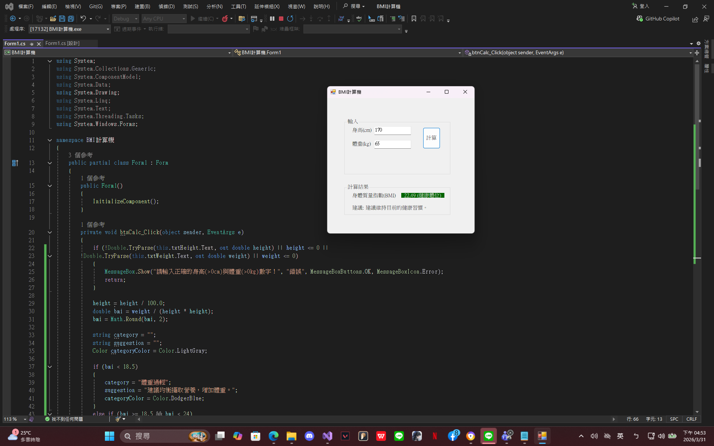

# BMI計算機

輸入身高(cm)、體重(kg)，按下計算按鈕後，會顯示 BMI值、BMI分類、建議。

## 執行說明

1\. 使用 Visual Studio 開啟 `BMI計算機.sln`

2\. 執行

## 專案截圖

  

## 新增內容
新增建議文字方塊
* **當bmi < 18.5 建議均衡攝取營養，增加體重。
* **當bmi >= 18.5 && bmi < 24 建議維持目前的健康習慣。
* **當bmi >= 24 && bmi < 27 建議規律運動，控制飲食。
* **當bmi > 27 建議諮詢專業醫師或營養師，制定減重計畫。
